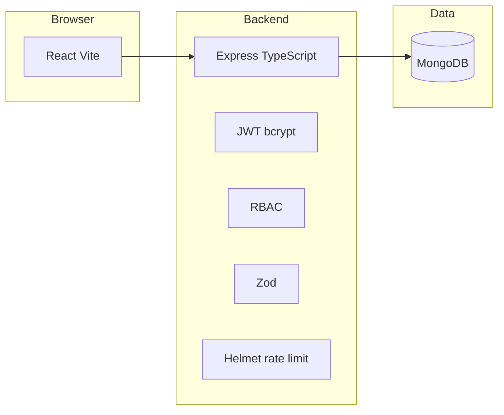

# Enterprise Project & Resource Management (PRM)

Production-style monorepo for **project, task, and user management** with JWT authentication, role-based access control (Admin, Manager, User), and a React dashboard. It is intended as a **reference implementation** for **DevSecOps maturity between L2 and L3**: real CI/CD and security tooling, with **deliberate gaps** typical of organizations that automate builds but do not yet enforce full supply-chain or runtime security programs.

This repository **does not** contain real secrets, tokens, or passwords. Copy [`.env.example`](.env.example) to `.env` and set your own values locally or in your deployment platform.

## Architecture



- **Frontend** ([`frontend/`](frontend/)): React 19, Vite 6, Tailwind CSS 4. Uses `VITE_API_URL` when the API is on a different origin; in local dev, Vite proxies `/api` to the backend.
- **Backend** ([`backend/`](backend/)): Node.js 22 LTS, Express, TypeScript, Mongoose. REST API under `/api/v1`. Structured logging with **pino** (operational logs only; **no** audit trail product).
- **Database**: MongoDB 7 (Docker / Codespaces).

### RBAC summary

| Capability | Admin | Manager | User |
|------------|-------|---------|------|
| User directory CRUD | Yes | No | No (self profile only) |
| Projects | All | Own / member | Own / member |
| Tasks | All projects | Allowed projects | Allowed projects |

## Requirements

- **Node.js** 22+ (see [`.nvmrc`](.nvmrc))
- **npm** 10+
- **Docker** and **Docker Compose** (for containerized MongoDB + API + static UI)

## Quick start with Docker

1. Copy environment templates and set **non-default** values (especially `JWT_SECRET`):

   ```bash
   cp .env.example .env
   ```

2. Start the stack:

   ```bash
   docker compose up --build
   ```

3. Open the UI at **http://localhost:8080** and the API at **http://localhost:4000** (health: `GET http://localhost:4000/health`).

4. **Sign in:** the API creates a default **admin** on first startup (after Mongo is available). On the login page use **username `superadmin`** or **email `superadmin@prm.local`**, and password **`superadmin`**. You can still use **Register** to add normal users (`user` role). To disable the default account in production, set **`DISABLE_DEFAULT_SUPERADMIN=true`** in the environment (see [`.env.example`](.env.example)).

   Optional: `npm run seed -w backend` with `MONGO_URI`, `SEED_ADMIN_EMAIL`, and `SEED_ADMIN_PASSWORD` in `.env` creates an additional admin if you need a different email.

**Compose services**: `mongo`, `api` (backend image), `web` (nginx + built SPA). API reads `MONGO_URI`, `JWT_SECRET`, `JWT_EXPIRES_IN`, `CORS_ORIGIN`. The web image is built with `VITE_API_URL` defaulting to `http://localhost:4000` so the browser can call the API from your machine.

## GitHub Codespaces

1. Open the repository in a **Codespace** (`.devcontainer` is provided).
2. After `postCreateCommand` (`npm install`), create a `.env` from [`.env.example`](.env.example) with `MONGO_URI=mongodb://localhost:27017/prm` (or the hostname you use), `JWT_SECRET` (≥16 characters), and `CORS_ORIGIN=http://localhost:5173`.
3. Start MongoDB (e.g. `docker compose up mongo -d` if Docker-in-Docker is enabled) or point `MONGO_URI` at MongoDB Atlas.
4. Run the API: `npm run dev -w backend`
5. Run the UI: `npm run dev -w frontend`
6. Open the forwarded port for Vite (5173).

The dev container image is **Node 22 on Debian bookworm** with **Docker-in-Docker** so `docker compose` matches local behavior.

## Local development (without full Docker stack)

```bash
npm install
# Start MongoDB locally or set MONGO_URI to a cloud instance
npm run dev -w backend
npm run dev -w frontend
```

## Environment variables

See **[`.env.example`](.env.example)** for variable **names** and short descriptions. Never commit a populated `.env`.

| Variable | Used by | Purpose |
|----------|---------|---------|
| `MONGO_URI` | API | MongoDB connection string |
| `JWT_SECRET` | API | Symmetric key for JWT signing (long random value in real environments) |
| `JWT_EXPIRES_IN` | API | JWT lifetime (e.g. `7d`) |
| `PORT` | API | Listen port (default 4000) |
| `CORS_ORIGIN` | API | Comma-separated allowed browser origins |
| `NODE_ENV` | API | `development` / `production` / `test` |
| `SEED_ADMIN` / `SEED_ADMIN_EMAIL` / `SEED_ADMIN_PASSWORD` | API startup (optional) | One-time admin bootstrap when enabled |
| `VITE_API_URL` | Frontend build / dev | Optional absolute API base; empty uses same origin or Vite proxy |

Frontend-only copy: [`frontend/.env.example`](frontend/.env.example).

## API overview

Base path: **`/api/v1`**

- **Auth**: `POST /auth/register`, `POST /auth/login`
- **Users**: `GET/PATCH /users/me`; Admin: `GET/POST/PATCH/DELETE /users`, `PATCH/DELETE /users/:id`
- **Projects**: `GET/POST /projects`, `GET/PATCH/DELETE /projects/:id`
- **Tasks**: `GET/POST /projects/:projectId/tasks`, `GET/PATCH/DELETE /projects/:projectId/tasks/:taskId`

Send `Authorization: Bearer <token>` for protected routes.

## Security tooling (manual)

Run from the **repository root** after `npm ci`:

```bash
# Dependency vulnerabilities (JSON report)
npm audit --json > npm-audit-report.json

# Fail only on critical count (same logic as CI)
node scripts/fail-on-critical-audit.mjs npm-audit-report.json
```

**Snyk** (requires a Snyk account and token in the environment — do not commit tokens):

```bash
npx snyk auth   # interactive, or export SNYK_TOKEN in your shell session
npx snyk test --all-projects
```

**Trivy** (image built locally as `prm-api:local`):

```bash
docker build -f backend/Dockerfile -t prm-api:local .
trivy image --severity CRITICAL,HIGH,MEDIUM,LOW --exit-code 0 prm-api:local
```

**ESLint** (backend uses `eslint-plugin-security`):

```bash
npm run lint -w backend
```

## CI/CD (GitHub Actions)

All workflows use maintained actions (`actions/checkout@v4`, `actions/setup-node@v4`, etc.).

| Workflow | File | Trigger | What it does |
|----------|------|---------|----------------|
| **CI** | [`.github/workflows/ci.yml`](.github/workflows/ci.yml) | `push`, `pull_request` | `npm ci` → **lint** (workspaces) → **test** (Vitest + MongoMemoryServer) → **typecheck** (frontend) → **build** (backend `tsc`, frontend `vite build`) |
| **Security** | [`.github/workflows/security.yml`](.github/workflows/security.yml) | `pull_request` | Publishes **`npm audit` JSON** artifact; **fails only on critical** findings via [`scripts/fail-on-critical-audit.mjs`](scripts/fail-on-critical-audit.mjs); optional **Snyk** when `SNYK_TOKEN` is configured (step uses `continue-on-error` — not fully enforced); **ESLint** with security rules and artifact upload |
| **Docker** | [`.github/workflows/docker.yml`](.github/workflows/docker.yml) | `push`, `pull_request`, `workflow_dispatch` | Builds the API image from [`backend/Dockerfile`](backend/Dockerfile); **Trivy** table + SARIF artifacts (non-blocking full scan); **separate gate fails only on CRITICAL** image findings |

This matches an **L2–L3** story: automated pipelines and real scanners exist, but **medium/low dependency issues do not fail** the main audit gate, **Snyk is optional**, and **container policy** only hard-fails on **critical** severity.

## Application security (implemented vs intentional gaps)

**Implemented:** JWT + bcrypt, RBAC, Zod validation, Helmet, rate limiting (stricter on auth routes), structured errors, CORS configuration, MongoDB access from API only.

**Intentionally not implemented** (for maturity-gap discussion): MFA, audit logging, centralized monitoring/APM, secrets scanning in CI, IaC scanning, policy-as-code engine, security KPIs dashboards.

## DevSecOps maturity (L2–L3)

**L3-style traits in this repo**

- CI runs automatically on every push and pull request with consistent stages (install, lint, test, typecheck, build).
- Multiple workflows separate **build/test**, **dependency and static analysis**, and **container image scanning**.
- Container image is built in CI and scanned with **Trivy**; results are retained as artifacts.

**L2-style / intentional gaps**

- `npm audit` **does not** fail on high/medium/low; only **critical** counts fail the security workflow gate.
- **Snyk** runs only when a token is present and does not block the workflow outcome (`continue-on-error`).
- No **secret scanning**, **IaC scanning**, or **OPA/Kyverno**-style policy enforcement in CI.
- No **metrics** export for vulnerability SLAs or pipeline DORA metrics.

Use these gaps explicitly when scoring an organization against a maturity model.

---

## Deploying with Jenkins, Docker Hub, and AWS EKS

This section is **documentation only**; adapt names, regions, and ARNs to your organization. **Do not** embed real credentials in Jenkinsfiles or Kubernetes manifests in git.

### 1. Docker Hub

1. Create repositories (e.g. `your-dockerhub-org/prm-api` and optionally `your-dockerhub-org/prm-web`).
2. On a trusted build host or Jenkins agent with Docker:

   ```bash
   docker login -u YOUR_DOCKERHUB_USER
   docker build -f backend/Dockerfile -t your-dockerhub-org/prm-api:1.0.0 .
   docker push your-dockerhub-org/prm-api:1.0.0
   ```

3. Store Docker Hub credentials in Jenkins (e.g. **Username/Password** or **Secret text** credentials) and reference them by ID in the pipeline (see snippet below).

### 2. AWS EKS (high level)

1. Create an EKS cluster and node groups (for example with `eksctl`, Terraform, or the AWS console).
2. Install a supported **ingress controller** (commonly **AWS Load Balancer Controller** for ALB/NLB ingress).
3. Create a namespace for the app, e.g. `prm`.
4. Store sensitive configuration in **AWS Secrets Manager** or **SSM Parameter Store**, and sync to Kubernetes **Secrets** (e.g. External Secrets Operator, CSI driver, or CI `kubectl` apply of sealed secrets). At minimum you need `MONGO_URI` (often DocumentDB or Atlas reachable from the cluster) and `JWT_SECRET`.
5. Deploy **Deployments** and **Services** for `api` and `web`. Point the frontend build-time `VITE_API_URL` at the public URL of the API (or terminate TLS on a shared ingress host and use relative `/api` with an ingress rule).

Example **Deployment** shape (illustrative — replace image and env references):

```yaml
apiVersion: apps/v1
kind: Deployment
metadata:
  name: prm-api
spec:
  replicas: 2
  selector:
    matchLabels: { app: prm-api }
  template:
    metadata:
      labels: { app: prm-api }
    spec:
      containers:
        - name: api
          image: docker.io/your-dockerhub-org/prm-api:1.0.0
          ports: [{ containerPort: 4000 }]
          env:
            - name: MONGO_URI
              valueFrom: { secretKeyRef: { name: prm-secrets, key: mongo-uri } }
            - name: JWT_SECRET
              valueFrom: { secretKeyRef: { name: prm-secrets, key: jwt-secret } }
            - name: CORS_ORIGIN
              value: "https://app.example.com"
```

### 3. Jenkins pipeline (illustrative)

Use a **Multibranch Pipeline** or **Pipeline** job with credentials bound by ID (`docker-hub`, `eks-kubeconfig`). Stages typically: checkout → `npm ci` → test → build → Docker build/push → `kubectl apply` or Helm upgrade.

```groovy
pipeline {
  agent any
  environment {
    IMAGE = 'docker.io/your-dockerhub-org/prm-api'
    TAG   = "${env.BUILD_NUMBER}"
  }
  stages {
    stage('Checkout') {
      steps { checkout scm }
    }
    stage('Test and build') {
      steps {
        sh 'npm ci'
        sh 'npm test'
        sh 'npm run typecheck'
        sh 'npm run build'
      }
    }
    stage('Docker build and push') {
      steps {
        withCredentials([usernamePassword(credentialsId: 'docker-hub',
            usernameVariable: 'DH_USER', passwordVariable: 'DH_PASS')]) {
          sh 'echo "$DH_PASS" | docker login -u "$DH_USER" --password-stdin'
          sh "docker build -f backend/Dockerfile -t ${IMAGE}:${TAG} ."
          sh "docker push ${IMAGE}:${TAG}"
        }
      }
    }
    stage('Deploy to EKS') {
      steps {
        withCredentials([file(credentialsId: 'eks-kubeconfig', variable: 'KUBECONFIG')]) {
          sh "kubectl -n prm set image deployment/prm-api api=${IMAGE}:${TAG}"
        }
      }
    }
  }
}
```

For GitOps, replace the final stage with a commit to a Helm values repository or trigger Argo CD / Flux reconciliation.

## License

This reference application is provided **as-is** for education and maturity assessments. Add your own license if you fork it for product use.
